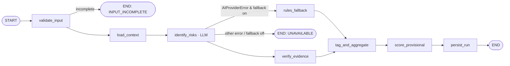

# LangGraph Workflow — Risk Identification

## 1. Current graph (`app/langgraph/graph.py`)

```
START → load_assessment → gather_intelligence → identify_risks (LLM) → calculate_scores → persist_results → END
```

- Linear, synchronous, invoked by `run_risk_assessment_workflow(assessment_id, db)`; nodes share the request's SQLAlchemy session.
- `identify_risks` calls `identify_risk_factors()` (one OpenRouter call over all 10 categories) and does quote verification inside the analyzer; on `AIProviderError` it falls back to `RiskEngine` (rules-only) inside the same node.
- `calculate_scores` runs `calculate_inherent_risk` with all factors unrated (provisional only).
- `persist_results` supersedes AI/RULES factors, inserts new ones, recalculates, writes mode fields and an `ANALYSIS` audit event, commits.
- Every node is a Langfuse span (`_traced`).

Assessment: sound design, correct AI/deterministic boundary. Gaps: no run record, no input-completeness gate before paying for an LLM call, evidence verification hidden inside the AI module, degraded routing is an `if` inside a node instead of a graph edge, no progress reporting, shares the HTTP request's session.

## 2. Evaluation of candidate nodes

| Candidate node | Decision | Implemented as | Why |
|---|---|---|---|
| 1 Assessment intake | Outside graph | API + `assessments` table | Human data entry, not orchestration |
| 2 Data validation | **Node** `validate_input` (deterministic) | Python | Cheap gate before a paid LLM call |
| 3 Completeness check | Merged into `validate_input` | Python | Same inputs; produces `missing_information` |
| 4 Product risk analysis | Inside `identify_risks` | LLM (category `PRODUCT_SERVICE_RISK`) | One structured call covers all categories consistently |
| 5 AML analysis | Inside `identify_risks` as typology tag | LLM + deterministic tag rules | Typology is cross-cutting, not a separate pass |
| 6 Sanctions analysis | Inside `identify_risks` (indicator `SANCTIONS_EXPOSURE`) + deterministic topic-cue check + escalation rule `SANCTIONS_EXPOSURE_001` | LLM + Python | Highest-stakes signal must be verified deterministically |
| 7 Fraud analysis | Typology tag | LLM + Python | As 5 |
| 8 Bribery/corruption | Typology tag (+ proposed indicators, Q-02) | LLM + Python | As 5 |
| 9 Geographic risk | `load_context` (FATF/EU attested designations) + LLM category `GEOGRAPHIC_RISK` | Python + LLM | Designation lookup must never be an LLM opinion |
| 10 Regulatory/policy analysis | Deterministic rules (methodology escalation rules, reference data) | Python | Policy = configured rules, versioned and fingerprinted |
| 11 Evidence evaluation | **Node** `verify_evidence` | Python (`risk_engine/evidence.py`) | Deterministic, testable, auditable |
| 12 Risk factor aggregation | **Node** `tag_and_aggregate` | Python | Normalise categories, fill omitted categories, typology tags |
| 13 Deterministic risk scoring | **Node** `score_provisional` | Python (`scoring.py`) | Provisional until analyst ratings exist |
| 14 Recommendation generation | Outside graph (draft generation at RESIDUAL_RISK → HUMAN_REVIEW) | LLM (advisory) | Needs controls + residual, which exist only later |
| 15 Human review | Outside graph | App state machine | Days/weeks, multi-user; not a graph interrupt |
| 16 Finalisation | Outside graph | Approvals + decision record | Human decision + checksum |

**Result:** 7 nodes, 1 of which calls an LLM. No multi-agent design.

## 3. Target graph



(Rendered version with notes: `diagrams/ai-workflow.mmd`.)

`WORKFLOW_NAME = "risk_identification"`, `WORKFLOW_VERSION = "2.0.0"` (constants in `graph.py`; bump on any node/edge/contract change). `graph_hash` = SHA-256 of sorted node names + edges, recorded on the run.

## 4. State (`RiskAssessmentState`, extended)

Existing keys retained (`assessment_id`, `assessment`, `intelligence`, `risk_factors`, `overall_score`, `risk_level`, `previous_status`, `status`, `error`, `ai_available`, `assessment_mode`, `ai_status`, `score_source`, `is_provisional`, `requires_human_review`, `degraded_reason`, `technical_error_code`, `unevaluated_categories`). **New:**

| Key | Type | Set by |
|---|---|---|
| `run_id` | int | caller (created before invoke) |
| `input_issues` | list[{field, code, message}] | `validate_input` |
| `evidence_sources` | dict[source_id → {label, normalized, checksum, document_id, version}] | `load_context` |
| `jurisdiction_context` | {matches[], snapshots_used[], snapshots_skipped[], unresolved[]} | `load_context` |
| `similar_context` | list | `load_context` (pgvector) |
| `methodology` | {id, version, fingerprint, config} | `load_context` |
| `raw_ai_factors` | list (unverified model output) | `identify_risks` |
| `raw_output` | str (masked) | `identify_risks` |
| `prompt_version` | {key, version, sha256} | `identify_risks` |
| `model` | {requested, response} | `identify_risks` |
| `evidence_stats` | {verified, rejected_quotes, rejected_indicators} | `verify_evidence` |
| `progress` | callable(progress, stage_key, message) | caller |

The graph gets a **dedicated session** from the worker (not the HTTP request session).

## 5. Node contracts

| Node | Purpose | Input | Output | Type | Model? | Prompt? | Validation | Failure behaviour | Persisted | Audit |
|---|---|---|---|---|---|---|---|---|---|---|
| `validate_input` | Refuse to spend an LLM call on an assessment that cannot be assessed | assessment row, intelligence | `input_issues` | Python | No | No | Mandatory intake fields present; intelligence `confirmed`; ≥1 citable source with ≥200 chars total | Blocking issues → END with `status=INPUT_INCOMPLETE`, run `FAILED`, no factor changes | run status + issues in `output_summary` | `ANALYSIS_BLOCKED` with issue codes |
| `load_context` | Assemble everything the model may use and everything scoring needs | assessment id | `assessment` (masked dict), `evidence_sources`, `jurisdiction_context`, `similar_context`, `methodology` | Python + DB reads (+ embeddings call) | Embeddings only | No | Sources built by `build_evidence_sources`; countries resolved via `country_normalizer`; only **attested** snapshots | Embedding failure → continue without similar context (existing behaviour); DB error → UNAVAILABLE | `input_sha256`, `input_snapshot`, `reference_snapshot_ids`, methodology fingerprint on run | — |
| `identify_risks` | Ask the LLM which categories apply, indicators, verbatim quotes, conflicting flag, missing info, rationale, misuse scenario, typologies | prompt context | `raw_ai_factors`, `raw_output`, `model`, `prompt_version` | **LLM** | Yes (pinned) | Yes `risk_factor_identification` | JSON parse; exactly 10 known categories (unknown → `AIInvalidResponseError`, D-19); no numeric fields accepted | `AIProviderError` → edge to `rules_fallback` (if `ENABLE_RULES_ONLY_FALLBACK`), else UNAVAILABLE; any other error → UNAVAILABLE | `raw_output`, model, prompt version on run; `ai_usage_logs` row (metered) | `AI_CALL` via usage log |
| `rules_fallback` | Deterministic provisional factors when AI is down | assessment, intelligence | factors (unrated, `NOT_VERIFIED`), `assessment_mode=rules_only`, `unevaluated_categories` | Python (`RiskEngine`) | No | No | Rule engine produced ≥1 factor | No factors / exception → UNAVAILABLE | mode fields | `AI_ANALYSIS_DEGRADED` |
| `verify_evidence` | Keep only quotes found verbatim in cited sources; accept indicators only with a verified, on-topic quote | `raw_ai_factors`, `evidence_sources` | factors with `evidence`, `indicators`, `rejected_indicators`, `evidence_status`, `missing_information` | Python (`verify_factor_evidence`) | No | No | ≥12 chars; exact normalised match; sanctions topic cues | Never fails the run; unverifiable → status `NOT_VERIFIED` / `INSUFFICIENT_EVIDENCE` | `evidence_stats` on run | — |
| `tag_and_aggregate` | Normalise output into the canonical 10 factors; fill omitted categories as not-applicable with a note; derive/validate typology tags | factors | canonical factor list | Python | No | No | Typology tags ⊆ enum; **deterministic tag rules add** `SANCTIONS` when `SANCTIONS_EXPOSURE` accepted, `AML` when any of CASH_ACCESS / ANONYMITY / UNKNOWN_PARTY_PAYMENTS / COMPLEX_OWNERSHIP_STRUCTURES accepted, `FRAUD` when REMOTE_ONBOARDING or TRANSACTION_VELOCITY accepted; AI-proposed tags without a supporting accepted indicator are kept but marked `inferred` | — | — | — |
| `score_provisional` | Compute the provisional inherent result (all AI factors unrated → normally no score unless an approved rule fires on a verified indicator) | factors, methodology | `overall_score`, `risk_level`, `is_provisional` | Python (`calculate_inherent_risk`) | No | No | Unavailable mode → `None` (never 0/LOW) | — | — | — |
| `persist_run` | Supersede previous AI/RULES factors, insert new, recalc inherent (carrying forward manual factors and prior analyst ratings for unchanged categories — see §6), write mode fields, finish run | all | `status=COMPLETED` | DB transaction | No | No | One transaction | Rollback → run `FAILED`; previous factors remain current | `risk_factors` (with `analysis_run_id`), `inherent_risk_calculations`, `assessments.latest_analysis_run_id`, run terminal status | `ANALYSIS` (with evidence summary, run uuid) |

Progress mapping reported to `processing_jobs`: `validate_input` 5 %, `load_context` 15 %, `identify_risks` 20→70 %, `verify_evidence` 80 %, `tag_and_aggregate` 85 %, `score_provisional` 90 %, `persist_run` 95 %, done 100 %.

## 6. Re-runs and carried-forward ratings

- A re-run creates a new `analysis_runs` row with `parent_run_id` = previous run.
- New AI factors supersede old AI/RULES factors (existing behaviour). **New rule:** if a category is applicable in both runs and its accepted indicator set is unchanged, the analyst's previous `likelihood/impact` is carried forward with `rating_source = CARRIED_FORWARD` and flagged for re-confirmation; otherwise the factor starts unrated. This avoids silently discarding analyst work while never silently reusing it when evidence changed.
- MANUAL factors are never superseded by a run.

## 7. Other AI tasks (not graphs)

The remaining AI tasks are single calls and do **not** use LangGraph (no branching, no multi-step state):

| Task | Trigger | Run record | Failure behaviour |
|---|---|---|---|
| Document extraction | document upload job | `analysis_runs(DOCUMENT_EXTRACTION)` | Job `PARTIAL`; manual entry still possible |
| L×I suggestion | "Suggest ratings with AI" | `analysis_runs(LIKELIHOOD_IMPACT_SUGGESTION)` | Suggestions empty; analyst rates manually |
| Control identification / design | Controls stage | `analysis_runs(CONTROL_*)` | 502 `AI_PROVIDER_ERROR`; manual mapping |
| Draft narrative | RESIDUAL_RISK → HUMAN_REVIEW, or "Regenerate" | `analysis_runs(DRAFT_NARRATIVE)` | Deterministic template (`generation_method = deterministic-template`, existing) |

## 8. Why not LangGraph checkpointing / interrupts for human review

Human review spans days and multiple users with RBAC, SLA escalation and delegation — all already implemented in the application state machine and Postgres. Moving that into LangGraph `interrupt()` + a checkpointer would duplicate state, couple approval logic to an orchestration library, and complicate audit. LangGraph is scoped to the **machine** part of the process (seconds to minutes). Production may add `PostgresSaver` checkpointing to resume a crashed run mid-graph; not required for MVP because runs are short and retryable.

## 9. Testing the graph

- Unit: each node as a pure function with a fake state (existing `tests/workflow/test_langgraph.py` pattern).
- Fake LLM (`tests/support/fake_llm.py`) scenarios: valid, invalid JSON, unknown category, timeout, rate limit, prompt-injection text in source, paraphrased quote.
- Replay test: feed a stored `raw_output` through `verify_evidence → tag_and_aggregate → score_provisional` and assert identical factors/score (reproducibility).
- DeepEval dataset (21 cases) as the regression gate for prompt/model changes (see `ai-governance.md`).
